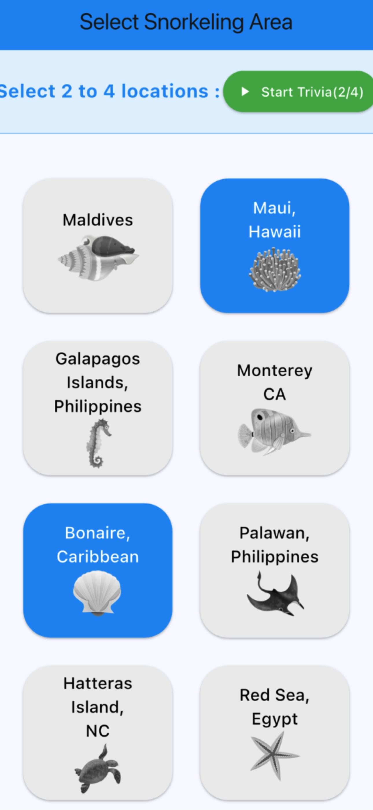

# 🐠🌊 SeaSnorkel Trivia

Explore the world’s most stunning snorkeling destinations—each trivia section is organized by world-famous reefs, coasts, and underwater paradises! From tropical lagoons to temperate kelp forests, challenge your knowledge and learn as you dive deeper into marine wonders. 🐬🌴

  

## 🚀 Key Features

🌍 **Discover Global Snorkeling Hotspots**  
Play through trivia organized by coral reefs, island bays, and ocean sanctuaries worldwide.  

🧠 **Test Your Knowledge**  
Answer multiple questions on marine life, snokeling, ecosystems, and cultural connections to the sea.  

🔄 **Replay & Improve**  
Each reef section offers new challenges and score-tracking for repeat play.  

🌟 **Learn as You Play**  
Every question is an opportunity to uncover fun facts about the underwater world.  

## 📱 Download for iOS

Download on the App Store  

## 📝 License

SeaSnorkel Trivia is under the MIT license. See the accompanying [LICENSE](LICENSE) for more information.  

##  🔧 Build

Can build the app with a Windows station and Android Studio. 
Then Android Studio can provide you an “.apk” file to side-load to your Android phone.
When you’ve forked the repo to make your own app, you can do a yearly subscription as an Android Developer to publish to their Appstore. 

Also can build the app with a Mac station, Xcode, Android Studio and a free developer account : [Create a Free Apple Developer account](https://www.appypie.com/blog/how-to-create-a-free-apple-developer-account)

Then Xcode will let you side-load to your iPhone. When you’ve forked the repo to make your own app, you can do a yearly subscription as an Apple Developer to publish to the Appstore. 

## 📚🖲️ Coding Editors 
To develop this app with your own topic or theme, there are a couple of A.I. tools to assist you along the way.  Cursor and Windsurf are A.I. based coding tools you can pull up alongside (vibe) your coding application like Xcode or Android Studio to add more screens, buttons, field elements and features for your app. 

Cursor A.I. coding tool : 
[Cursor](https://www.cursor.com)

Windsurf A.I. coding tool : 
[Windsurf](https://windsurf.com)

## 🤝 Contributing

We welcome 👩🏾‍💻👨🏾‍💻 additions! If you’d like to help improve or expand this project, feel free to open an issue or submit a pull request.

## 📬 Contact

For feedback or questions feel free to [message](mailto:leapdeck1@gmail.com) for assistance.
